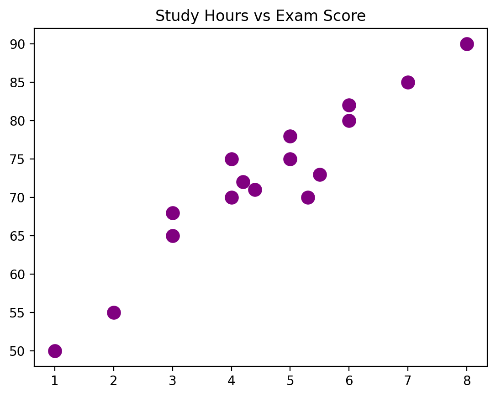
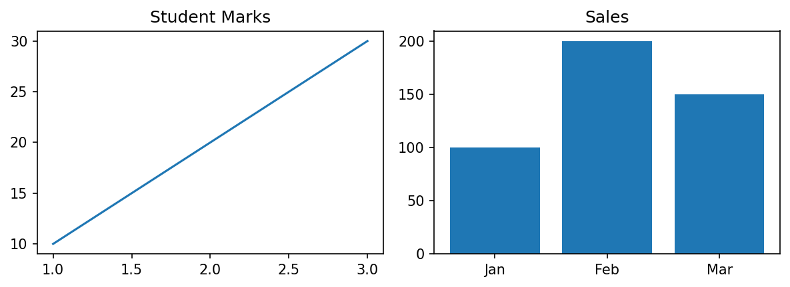
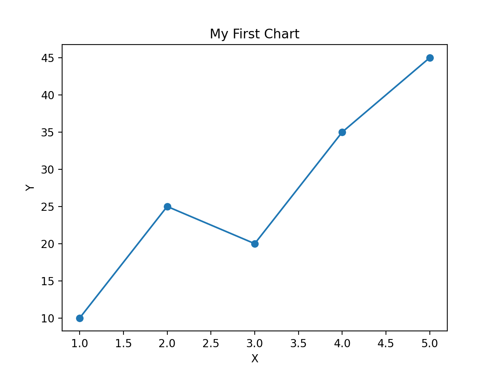

# Matplotlib and Seaborn for Data Science

A hands-on collection of Jupyter notebooks for learning **data visualization in Python** with **Matplotlib** and **Seaborn** — from your very first line chart to subplots, dashboards, heatmaps and animations.


---

## 📁 Project Structure

```
Matplotlib_and_Seaborn_For_Data_Science/
├── Notebooks/                     # All Jupyter notebooks
│   ├── matplotlib_for_beginners.ipynb
│   ├── subplot.ipynb
│   ├── Seaborn_for_Beginners.ipynb
│   └── Applied_Plotting__Charting___Data_Representation_in_Python.ipynb
├── data/                          # Datasets used by the notebooks
│   ├── traffic.csv                # Hourly traffic on MTA bridges & tunnels (NY Open Data)
│   └── bike_ride.csv              # Second-by-second bike ride sensor log
├── diagrams/                      # Charts saved/exported by the notebooks
│   ├── my_first_chart.png
│   ├── scatter_chart.png
│   └── dashboard.png
├── requirements.txt
└── README.md
```

> The notebooks load data with relative paths like `../data/traffic.csv` and save figures to `../diagrams/`, so run them from inside the `Notebooks/` folder.

---

## 📓 Notebooks

| # | Notebook | What you'll learn |
|---|----------|-------------------|
| 1 | [`matplotlib_for_beginners.ipynb`](Notebooks/matplotlib_for_beginners.ipynb) | Line, bar, pie, histogram and scatter plots built step by step; titles, labels, colors, line styles & markers; saving charts with `savefig`; alternative libraries; 10 practice tasks |
| 2 | [`subplot.ipynb`](Notebooks/subplot.ipynb) | `plt.subplot()` vs `plt.subplots()`, `figsize`, `sharex`/`sharey`, `suptitle`, mixing plot types, `subplots_adjust`, uneven layouts with `GridSpec`, exporting a multi-plot dashboard |
| 3 | [`Seaborn_for_Beginners.ipynb`](Notebooks/Seaborn_for_Beginners.ipynb) | Scatter, line, bar, count, histogram, box and heatmap plots with the `tips` dataset; `hue` and key parameters; pair, violin & regression plots; `FacetGrid`; customization; cheat sheet |
| 4 | [`Applied_Plotting__Charting___Data_Representation_in_Python.ipynb`](Notebooks/Applied_Plotting__Charting___Data_Representation_in_Python.ipynb) | Matplotlib architecture (backend/artist layers), scatter, line & bar charts, "dejunkifying" plots, subplots, histograms, boxplots, heatmaps, animations and interactive widgets — using real traffic and bike-ride data |

**Suggested order:** 1 → 2 → 3 → 4

---

## 📊 Datasets

| File | Description | Used in |
|------|-------------|---------|
| `data/traffic.csv` | Hourly vehicle counts (E-ZPass / VToll) at MTA bridge & tunnel toll plazas — *Hourly Traffic on MTA Bridges and Tunnels*, NY Open Data | Applied Plotting |
| `data/bike_ride.csv` | Time series of heart rate, cadence, speed, altitude, distance and temperature from a single bike ride | Applied Plotting |
| `tips` (built-in) | Restaurant tips dataset loaded with `sns.load_dataset("tips")` (needs internet) | Seaborn for Beginners |
| `iris` (online) | Loaded from the seaborn-data GitHub repo (needs internet) | Applied Plotting |

---

## 🖼️ Sample Outputs

| Scatter Chart | Subplot Dashboard | My First Chart |
|:---:|:---:|:---:|
|  |  |  |

---

## 🚀 Getting Started

1. **Clone the repository**
   ```bash
   git clone https://github.com/Yugalpoudel07/Matplotlib_and_Seaborn_For_Data_Science.git
   cd Matplotlib_and_Seaborn_For_Data_Science
   ```

2. **(Optional) Create a virtual environment**
   ```bash
   python -m venv venv
   # Windows
   venv\Scripts\activate
   # macOS / Linux
   source venv/bin/activate
   ```

3. **Install the dependencies**
   ```bash
   pip install -r requirements.txt
   ```

4. **Launch Jupyter and open a notebook**
   ```bash
   cd Notebooks
   jupyter notebook
   ```

---

## 🛠️ Tech Stack

- **Python 3**
- **NumPy** & **Pandas** — data handling
- **Matplotlib** — core plotting library
- **Seaborn** — statistical visualization built on Matplotlib
- **ipywidgets** — interactive widgets (Applied Plotting notebook)
- **Jupyter Notebook**

---

## 🙋 Author

**Yugal Poudel** — [@Yugalpoudel07](https://github.com/Yugalpoudel07)

If you find this repo helpful, consider giving it a ⭐!
